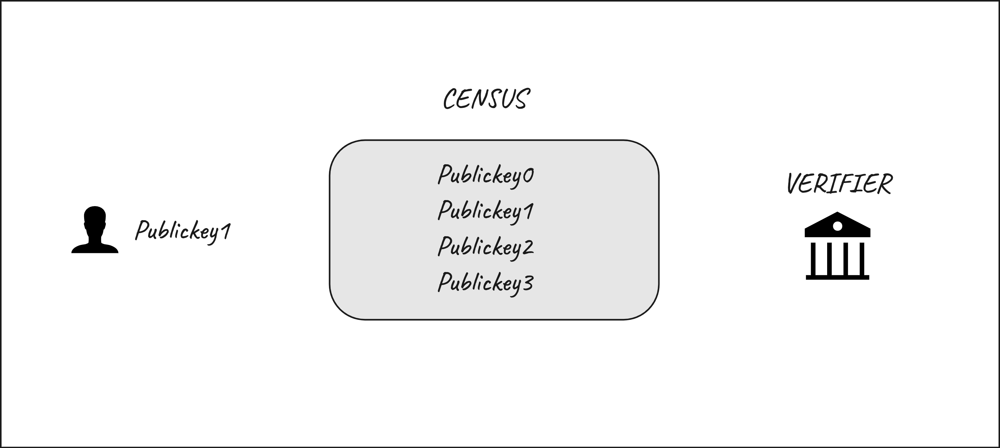
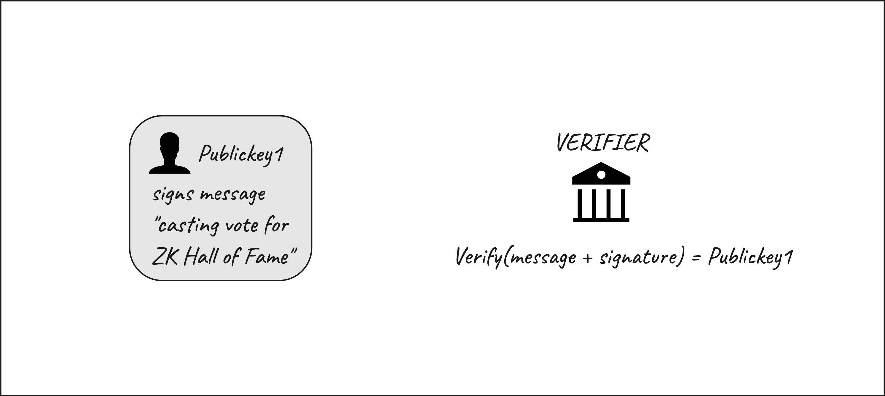
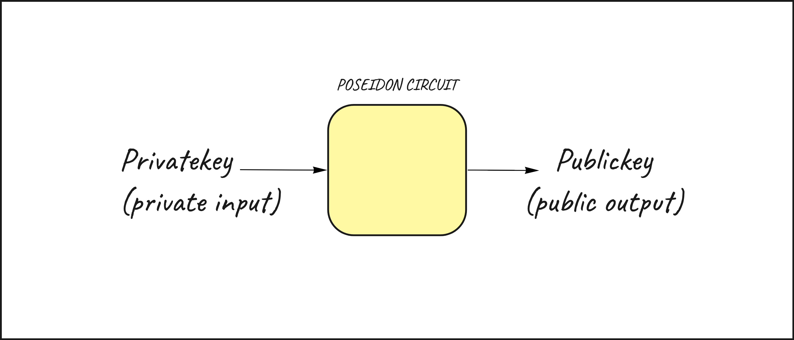
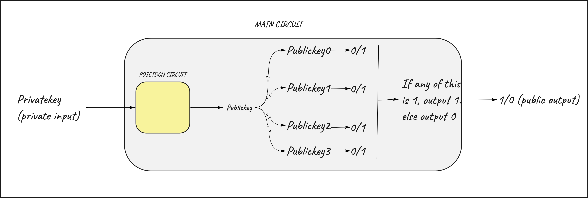
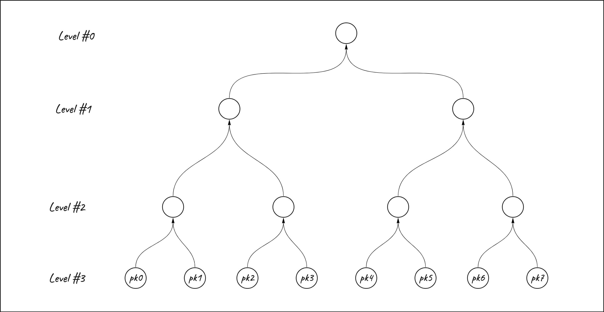
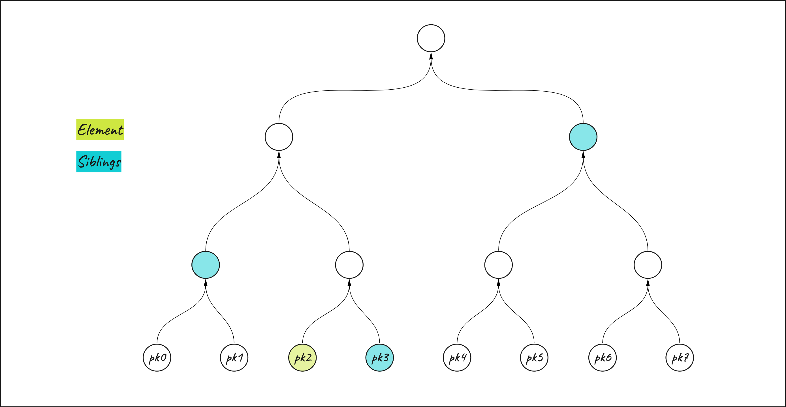
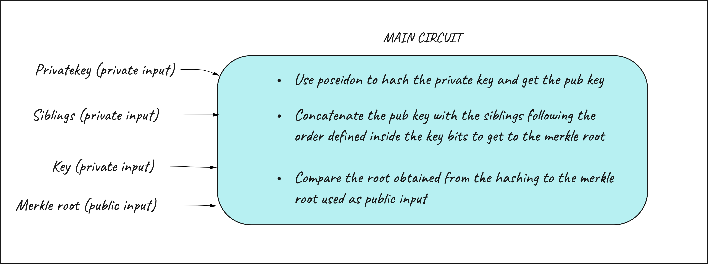
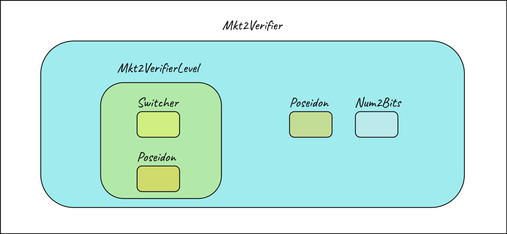
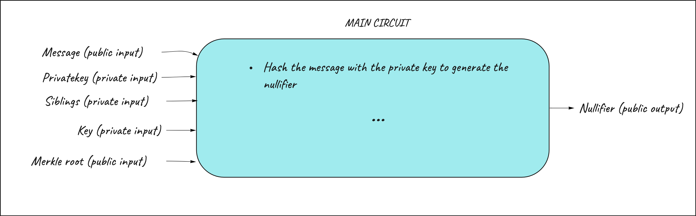

# Zero Knowledge Proof of Inclusion - Designing Circuits in Circom

In this tutorial we are gonna get our hands dirty by designing a zero knowledge proof application. If you are new to circom, it is encouraged to start from [here](https://docs.circom.io/getting-started/installation/).

The goal here is to allow a person to demonstrate their inclusion within a set of people (census) in order to cast a vote. The core elements here are: 

- A person that controls a private key and is identified by the corresponding public key (`pubkey1`)
- A census that includes a set of people identified by their public keys. The census includes many public keys including `pubkey1`
- A verifier, that wants to be sure that a user is part of the census in order to cast the vote 



In order to demonostrate his belonging to the census, the person needs to:

1) prove that he/she is the owner of a public key by demonstrating control of the corresponding private key. 
2) prove that that public key is included in the census

## Non ZKP way to proof inclusion in the census

A verifer passes a specific message to the person `message = "Casting vote for ZK Hall of Fame"`. The person signs it with their privaye key. Starting from the signature and the message, the verifier can retrieve the public key of the signer and check if this public key is part of the census. After the verification, the person is allowed to cast their vote.

This approach works fine, but in this case the verifier is fully aware of the identity of the person because he/she has been identified starting from the public key. This approach is not privacy preserving.



## ZKP way - First Attempt

In order to proof the inclusion inside the census in a privacy preserving way we need to build a circuit for that. 

In this specific case, the circuit must be designed in order to allow a user to: 

1) prove that he/she is the owner of a public key by demonstrating control of the corresponding private key. 

    Let's consider a simple signature schema that hashes the privaye key to generate the public key. The Poseidon template ([circomlib](https://github.com/iden3/circomlib)) allows to generate an hash inside a circuit.

    

2) prove that that public key is included in the census

    Now we need to extend the circuit in order to prove inclusion in the census. The circuit will first hash the private key to get to the public key and then compare it to each of the public keys included in the census. If it equals to any of the keys included in the census, the circuit will output 1.

    

Using this circuit a user can generate a proof demonstrating his/her inclusion inside the census without revealing any information about the private key used as input for the circuit and, therefore, about the public key derived from that. 

If the proof gets verified, the verifier is confident that a user is part of the census without having to know his/her identifier.

This circuit works but has a problem: it is not scalable. If the census contains an high number of public keys (for example 1M), the circuit will need to recursively check each of the 1M public keys included in the census.

This can be done in a more scalable way using a more efficient data structure to represent the census: a Merkle Tree! 

## ZKP way - Efficient Attempt

The main difference is this approach is that public keys will be included as leaves inside a Merkle Tree rather than in an simple array. Therefore the proof will need to demonstrate the inclusion of a public key inside this merkle tree.

In this case we are gonna take a census composed of 8 public keys that are gonna be the leaves of the merkle tree. The merkle tree has 3 levels and 8 leaves.



The leaves of the merkle tree are gonna be concatenated together using the poseidon hash function to compose the higher levels of the tree up to the root.

In order to prove the inclusion of an element inside a merkle tree I need the element itself and the siblings, namely the elements of the merkle tree needed to hash my element with in order to get to the merkle root. All the siblings together represent the merkle proof.



If the result of the hashing between the element and the siblings is equal to the merkle tree root, it means that the element is included in the merkle tree. 

Let's now build a circuit out of that. The goals are still the same:

1) prove that a person is the owner of a public key by demonstrating control of the corresponding private key. 
2) prove that that public key is included in the census

The input needed to build the circuit are: 

- User's `privateKey` 
- An array of `siblings` (related to the public key derived from the private key used as input). It's important to note that the siblings must be treated as private input since revealing the siblings would, indirectly, reveal the position of the public key of the prover inside the merkle tree. 
- A `key` that represent the position inside the merkle tree for the leaf we want to prove inclusion. The key is represented in bits format. The key is helpful to determine the relative position of a node to its sibling to help doing the hash. For example the leaf in position 3 of the merkle tree has `key = 011`. This will tell the compiler that on the first level the sibling is on its left (=1), the second level sibling on its left (=1) and the third level sibling on its right (=0). (remember that you need to read it starting from the last bit!)
- The `root` of the merkle tree that I want to prove inclusion in



# Build in Circom

### Design the circuit

To create our circuit we are gonna leverage already existing circuits defined as templates inside [circomlib](https://github.com/iden3/circomlib) such as poseidon, bitify and switcher and create a new support template defined `Mkt2VerifierLevel`. The main circuit is `Mkt2Verifier(nLevels)`.

The first thing is to define the input of the circuit as defined previously.

``` circom 
template Mkt2Verifier(nLevels) {

signal input key;
signal input value; 
signal input root;
signal input siblings[nLevels]; 
...

}
```

Let's design the circuit by following the steps defined previously

### 1. Use poseidon to hash the privaye key to get the public key 

To accomplish this goal we need to instantiate the Poseidon component inside our circuit and assign our `privateKey` as input for the poseidon circuit. Later on the hashed value, output of the poseidon component, will be used when building the merkle proof.

```
template Mkt2Verifier(nLevels) {

    signal input key; 
    signal input value; 
    signal input root; 
    signal input siblings[nLevels];

    // instantiate the poseidon component
    component hashV = Poseidon(1);

    // assign the privateKey as input to the hashV circuit
    hashV.inputs[0] <== value;

    ...

    // extract the output and assign it
    levels[i].low <== hashV.out;

    ... 
}
```

### 2. Concatenete the pub key with siblings following the order defined inside the key bits to get to the merkle root and compare it to the merkle root passed as public input

This goal can be split into 3 smaller parts: 

- First of all we need to convert the `key`, private input of the circuit as integer, into 3 bits format to help our circuit understand the order in which to hash the value and the siblings.

    This is accomplished by using the Num2Bits template.

    ```circom
    template Mkt2Verifier(nLevels) {

    signal input key; 
    signal input value; 
    signal input root; 
    signal input siblings[nLevels];

    component hashV = Poseidon(1);

    hashV.inputs[0] <== value;

    // instantiate the num2bits component
    component n2b = Num2Bits(nLevels); 

    // assign the key as input to the Num2Bits circuit. 
    n2b.in <== key;

    ... 

    // extract the output and assign it 
    levels[i].selector <== n2b.out[i];

    ```

- Secondly we need to define a support template that help us hashing two values inside a level of the merkle tree. 

    We are gonna call it `Mkt2VerifierLevel` and it will be a separed circuit.

    This circuit will take as input the two values to be hashed (`low` and `sibling`) and a `selector`. The output of the circuit will be the result of the hashing inside that particular level, we define it as `root`

    The selector contains the bit (extracted from the previous`n2b.out[i]`) that corresponds from a specifc level. A selector equals to `1` will tell the circuit that the `low` value is on the right so the hash must be `Hash(sibling, low)`. On the contrary if the selector equals to `0` it means that the `low` value is on the left position so the hash must be `Hash(sibling, low)`. 

    This operation of determining the order of the hash is accomplished by the Switcher template while the hashing itself is accomplished by the Poseidon template. 

    The switcher template returns the 2 values to be hashed in the correct left, right order. These 2 values will then be hashed together using poseidon hash.

    ```circom
    template Mkt2VerifierLevel() { 

        signal input sibling; 
        signal input low;
        signal input selector;
        signal output root; 

        component sw = Switcher(); // instantiate the Switcher component
        component hash = Poseidon(2); // instantiate the Poseidon component

        // assign the input to the switcher circuit
        sw.sel <== selector;
        sw.L <== low;
        sw.R <== sibling;

        // extract the output from the switcher circuit and assign it as input to poseidon circuit     
        hash.inputs[0] <== sw.outL;
        hash.inputs[1] <== sw.outR;

        // Assing the result of the hashing to root (output of the Mkt2VerifierLevel template)
        root <== hash.out;
    }

    ```

- Connect all the pieces together inside the main template `Mkt2Verifier`. 

    The main template `Mkt2Verifier` takes the number of levels of the merkle tree as parameter. Inside of this template our goal is to move upwards the tree levels to get the merkle root. This is done by instantiating the newly created `Mkt2VerifierLevel` component and iterating over each level of the tree.

    Inside the for loop, the inputs to the support template will be passed for each level. When the for loop is over, the last output extracted from the `Mkt2VerifierLevel` template is the merkle root obtained by progressively hashing the `value` with its `siblings`.

    Lastly, we need to compare the root obtained from the hashing to the merkle root used as public input of the circuit. This will let us prove that that public key is included in the merkle tree.

    ```circom 
    template Mkt2Verifier(nLevels) {

        signal input key; 
        signal input value; 
        signal input root; 
        signal input siblings[nLevels];

        component hashV = Poseidon(1);

        hashV.inputs[0] <== value;

        component n2b = Num2Bits(nLevels); 
        component levels[nLevels]; // instantiate the component that will contain the levels extracted from Mkt2VerifierLevel.

        n2b.in <== key;

    
        // for loop to create the levels
        for (var i=nLevels-1; i>=0; i--) {
            // initiate the component for the specific level
            levels[i] = Mkt2VerifierLevel();

            // assign the input to the Mkt2VerifierLevel circuit
            levels[i].sibling <== siblings[i];
            levels[i].selector <== n2b.out[i];
            // case for the first level
            if (i==nLevels-1) {
                levels[i].low <== hashV.out;
            } 
            // case for higher levels
            else {
                levels[i].low <== levels[i+1].root;
            }
        }

        // extract the output and check if the merkleroot generated inside the circuit equals to the merkle root passed as public input of the circuit.

        root === levels[0].root;
    }
    ```

Congratulations! The circuit is now fully designed using different components as lego blocks.



# Test the circuit

In order to run the circuit we need the circuit inputs. Input such as `siblings` and `merkleRoot` are related to the merkle tree. Luckily there are supporting programs that helps building the merkle tree starting from the list of leaves and extracting the merkle tree input from there.

To do that we are gonna leverage packages included in `circomlibjs`: 

- [`poseidon`](https://github.com/iden3/circomlibjs/blob/main/src/poseidon_reference.js) to perform the hashing inside the merkle tree 
- [`babyjub`](https://github.com/iden3/circomlibjs/blob/main/src/babyjub.js)] to create the element fields 
merkelize

This dependencies are then used:

- to [generate the merkle tree](https://github.com/jbaylina/voting_example/blob/main/test/mkt2cir.js#L17) leveraging the function [`merkelize`](https://github.com/jbaylina/voting_example/blob/main/js/mkt2.js#L3) 
- to [extract the merkleProof](https://github.com/jbaylina/voting_example/blob/main/test/mkt2cir.js#L19) leveraing the function [`getMerkleProof`](https://github.com/jbaylina/voting_example/blob/main/js/mkt2.js#L34)

The helpers to build the merkle tree are contained inside  `./js/mkt2.js`.
These functions are used inside our test file `./test/mkt2cir.js` to generate and test the circuit

In order to run the Mkt2Verifier(nLevels) we need to instanties the circuit designed previously specifing the number of levels of the merkle tree (3, in this case). This is done inside `./test/circuits/mkt2_tester.com`

To test the circuit we need [circom tester](https://www.npmjs.com/package/circom_tester). Circom tester helps compiling the circuit and generating the witness.

In this case we are proofing the existance of the public key generated from the value `33`, stored in position `2` of a merkle tree that contains 8 values as leaves. `[11,22,33,44,55,66,77,88]` represents an array of private keys that will be then hashed to get the 8 leaves of the tree.

```javascript
    // Input to the Mkt2Verifier(nLevels) circuit
   const input={
            key: F.e(2),
            value: F.e(33),
            root: root,
            siblings: mp
        };
```

To test the circuit and the merklize function
```
npm i circomtester
mocha
```

# To do next

## Challenge 1 - Verify the proof

The circuit has been designed and the witness generation has been tested. Still, we haven't generated the proof and had it verified. The next step is generate a proof starting from the input generated inside test/mkt2cir.js and verify it. You can do it following the step defined into the [Circom getting started tutorial](https://docs.circom.io/getting-started/proving-circuits/#verifying-from-a-smart-contract). Bonus point if you are able to execute the verification on-chain.

## Challenge 2 - Protect the protocol from replay attacks

There's still a problem here in the circuit we just design. The only thing that the verifier is able to read as public value is the merkle root. Using this circuit, the same user can potentially generate infinite proofs based on the inclusion of the same public key and always have this proof verified from the verifier. This can be a problem if the verifier, for example, wants to assign a single vote to each person according to the inclusion in the census.

To avoid this, we introduce a concept called `nullifier`. The nullifier is a value that must be unique for each user that tries to generate the proof that's not traceable back to the public key of the user. In this case the nullifier is the hash between the user's private key and the original message ("Casting vote for ZK Hall of Fame"). Each time the same user tries to generate a proof the nullifier will be the same. The nullifier must be a public output of the circuit so the verifier can check if a nullifier has already been "spent" when verifying the proof. 



Your goal is to introduce the nullifier inside the circuit to avoid people to reuse the same proof and vote more than once. 

Other circuits making use of nullifiers to avoid the "double spending" problem can be found here: 

- [Semaphore](https://github.com/semaphore-protocol/semaphore) - a zero-knowledge protocol for anonymous signalling on Ethereum.
- [Tornado Cash](https://github.com/tornadocash/tornado-core) - non-custodial private transactions on Ethereum

## Reference

This tutorial is extracted from the live demo performed by Jose Munoz Tapia at ZKHack#2. [Youtube](https://youtu.be/6XxVeBFmIFs?t=4732)
